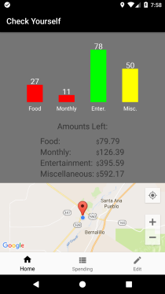
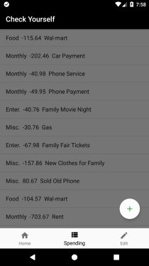
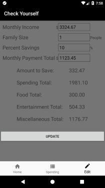

# Jake Batchelor's GitHub Portfolio

[Linkedin Profile](https://www.linkedin.com/in/jake-batchelor) -
[Github Profile](https://github.com/JakeBat) -
[Resume](JakeBatResumeUpdated.pdf)

Email - jacob_batchelor@outlook.com

## About me

Primarily a Java and Android developer with working knowledge of SQL like languages,
Javascript, C#, and Salesforce/APEX. A recent graduate of [Deep Dive Coding Bootcamp](
https://deepdivecoding.com/) looking to start a career in programming.

## Projects

### Check Yourself - A Budget Application

  

A personal project built in roughly 4 weeks. Android application built with:
- Java/Android SDK for main functionality
- SQLite for database
- Room as an ORM
- Incorporates Multiple Google API's(Maps for Android, Places for Android, and Places for
web services)

_[App Page](https://jakebat.github.io/check_yourself/)_ -
_[GitHub Page](https://github.com/JakeBat/check_yourself)_

### Hey Doc!

--Screenshots to come--

A project built by myself and [Ryan Lazo](https://www.linkedin.com/in/ryan-lazo-924024158/)
Another Android app with roughly 5-6 weeks of development, it was built using:
- Java/Android SDK for main functionality
- SQLite for local database and storage
- Room as an ORM
- Java EE, Spring, and Derby for backend server database
- More to come

_[App Page]()_ -
_[GitHub Page](https://github.com/deep-dive-coding-java-cohort-3/HeyDoc)_