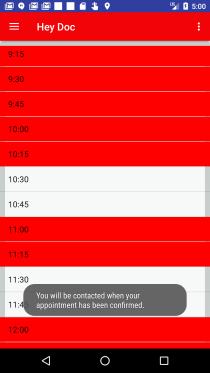

# Jake Batchelor's GitHub Portfolio

[Linkedin Profile](https://www.linkedin.com/in/jake-batchelor) -
[Github Profile](https://github.com/JakeBat) -
[Resume](JakeBatResumeUpdated.pdf)

Email - [jacob_batchelor@outlook.com](mailto:jacob_batchelor@outlook.com)

## About me

Primarily a Java and Android back-end developer with working knowledge of SQL like languages,
Javascript. Have experience using SpringBoot, Hibernate, and AWS to build a RESTful API back-end.
 A recent graduate of [Deep Dive Coding Bootcamp](https://deepdivecoding.com/) and recent got my **Oracle
 Java Developer Certification**. Currently looking to start a long successful career in programming.

## Projects

### Hey Doc!

  

A project built by [Ryan Lazo](https://www.linkedin.com/in/ryan-lazo-924024158/) and I.

Android app with roughly 5-6 weeks of development, it was built using:

#### Front-End
- Java/Android SDK for main functionality
- SQLite for local database and storage
- Room as an ORM

#### Back-End
- Backend hosted on Amazon Web Services (AWS) using Elastic BeanStalk
- Back-End built using:
  - SpringBoot
  - Hibernate
  - MySQL

_[Front-End App Page](https://deep-dive-coding-java-cohort-3.github.io/HeyDoc/)_ -
_[Back-End App Page](https://deep-dive-coding-java-cohort-3.github.io/hey-doc-be/)_ -
_[GitHub Page](https://github.com/deep-dive-coding-java-cohort-3/HeyDoc)_

### Check Yourself - A Budget Application

  

A personal project built in roughly 4 weeks. Android application built with:
- Java/Android SDK for main functionality
- SQLite for database
- Room as an ORM
- Incorporates Multiple Google API's(Maps for Android, Places for Android, and Places for
web services)

_[App Page](https://jakebat.github.io/check_yourself/)_ -
_[GitHub Page](https://github.com/JakeBat/check_yourself)_